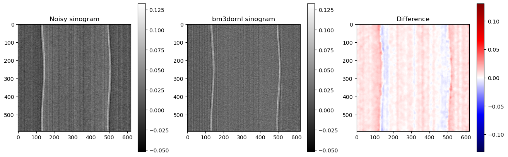
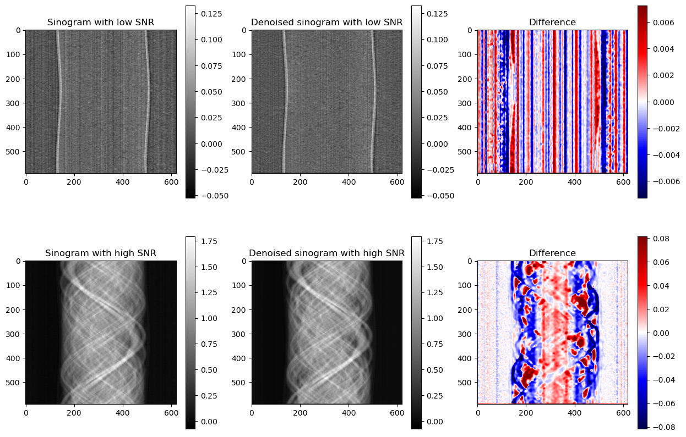
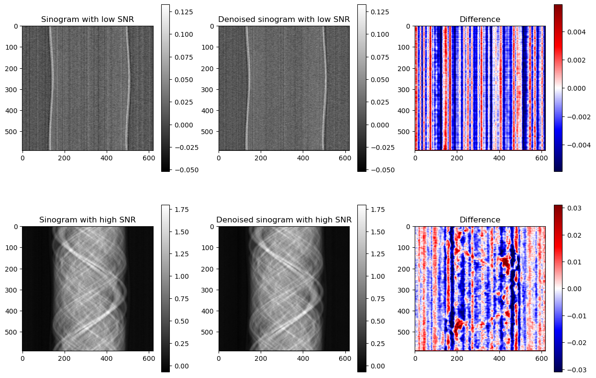
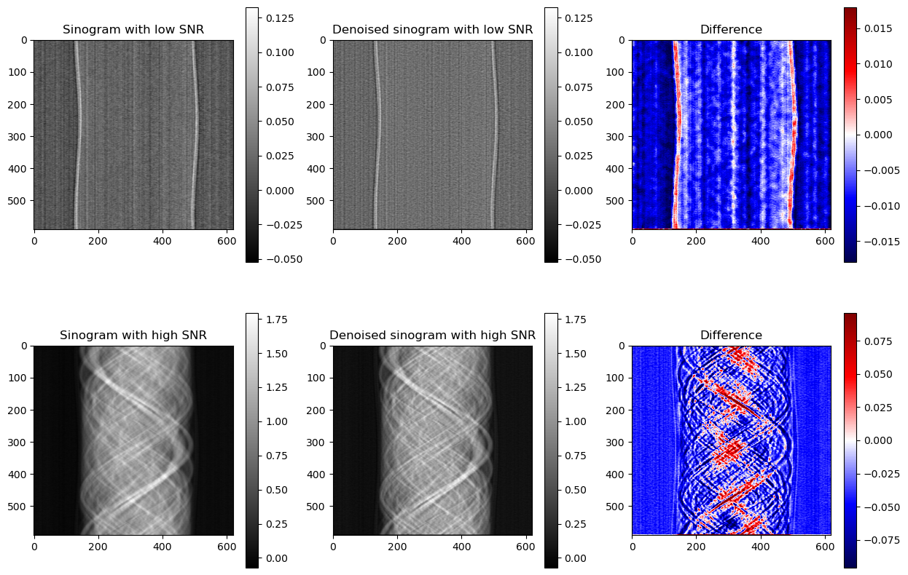

==========
User Guide
==========

This guide will help you get started using ``bm3dornl`` to perform ring artifact removal.
In order to use this library, an Nvidia card with CUDA support is required.

------------
Installation
------------

You can install bm3dornl from Conda using the following command:

.. code-block:: bash

    conda install -c neutronimaging bm3dornl

Or using pip:

.. code-block:: bash

    pip install bm3dornl

If you prefer installing from source directly from the repository, you can clone the repository and run the following command:

.. code-block:: bash

    git clone
    cd bm3dornl
    pip install .

-----
Usage
-----

There are two main ways to use ``bm3dornl``:

- Use ``bm3d_ring_artifact_removal`` to perform single-pass ring artifact removal.
- Use ``bm3d_ring_artifact_removal_ms`` to perform multi-scale ring artifact removal (feature to come in the next version).

^^^^^^^^^^^^^^^^^^^^^^^^^^^^^^^^^
Single-pass ring artifact removal
^^^^^^^^^^^^^^^^^^^^^^^^^^^^^^^^^

The core function of ``bm3dornl`` is ``bm3d_ring_artifact_removal``.
This function takes a 2D NumPy array as input and returns a 2D NumPy array with the ring artifacts removed from the sinogram.
The input sinogram must be normalized with flat field correction before using this function as the assume ring artifact is considered to be additive.

Here is an example of how to use this function:

.. code-block:: python

    from bm3dornl.bm3d import bm3d_ring_artifact_removal

    sinogram_denoised = bm3d_ring_artifact_removal(sinogram_input, mode="simple")

It is recommended to use the default values for the block matching and filtering parameters, unless you are familiar with the BM3D algorithm.
If you would like to customize the block matching and filtering parameters, you can pass them as keyword arguments to the function, i.e.:

.. code-block:: python

    from bm3dornl.bm3d import bm3d_ring_artifact_removal

    block_matching_kwargs: dict = {
        "patch_size": (8, 8),
        "stride": 3,
        "background_threshold": 0.0,
        "cut_off_distance": (64, 64),
        "num_patches_per_group": 32,
        "padding_mode": "circular",
    }

    filter_kwargs: dict = {
        "filter_function": "fft",
        "shrinkage_factor": 3e-2,
    }

    kwargs = {
        "mode": "express",
        "block_matching_kwargs": block_matching_kwargs,
        "filter_kwargs": filter_kwargs,
    }

    sinogram_denoised = bm3d_ring_artifact_removal(sinogram_input, **kwargs)

Currently, there are three modes available for the ring artifact removal:

- ``express``: This mode is the fastest (FFT notch filter for estimate and single-pass collaborative filtering for correction), and it is recommended for cases where over correction is not a concern.

- ``simple``: This mode is the default mode (FFT notch filter for estimate and re-filtering augmented collaborative filtering for correction), and it is recommended for most cases.

- ``full``: This mode is the slowest (Re-filtering augmented hard-thresholding for estimate and re-filtering augmented collaborative filtering for correction), and it is recommended for cases where the FFT notch filter does not provide acceptable estimate.

^^^^^^^^^^^^^^^^^^^^^^^^^^^^^^^^^
Multi-scale ring artifact removal
^^^^^^^^^^^^^^^^^^^^^^^^^^^^^^^^^

TO BE IMPLEMENTED
