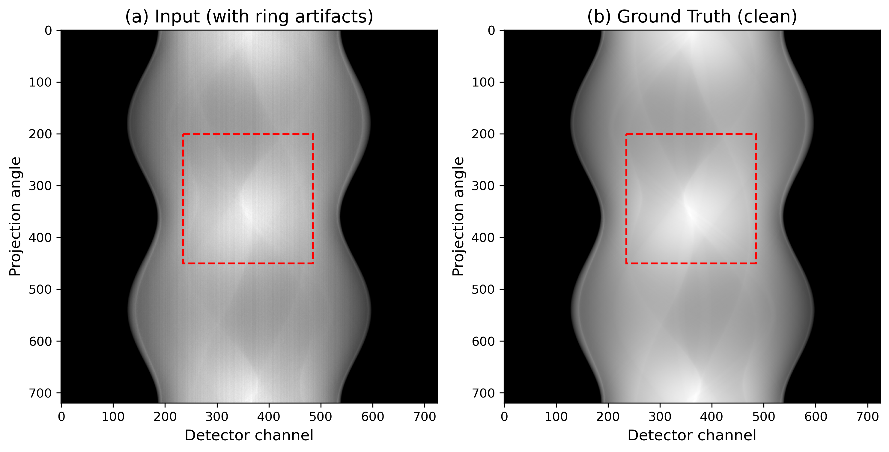

# Summary

BM3DORNL is a high-performance Python library for denoising neutron and X-ray tomography data using a modified Block-Matching and 3D Filtering (BM3D) algorithm.
The library provides two denoising modes: a generic mode for standard noise removal, and a specialized streak mode optimized for removing vertical streak patterns in sinograms that manifest as ring artifacts in reconstructed images.
Built with a Rust backend and Python bindings via PyO3, BM3DORNL achieves 160$\times$ faster processing than comparable BM3D implementations while maintaining cross-platform compatibility including native Apple Silicon support.

# Statement of Need

Ring artifacts are a persistent challenge in neutron and X-ray computed tomography, arising from variations in detector pixel response, beam intensity fluctuations, and systematic errors [@münch2009].
These artifacts appear as concentric rings in reconstructed images, obscuring sample structure and degrading quantitative analysis.
Pre-reconstruction streak removal addresses these artifacts directly in sinograms, avoiding the spatial spreading that occurs during reconstruction.
Existing approaches include wavelet-Fourier filtering [@münch2009], polynomial fitting [@vo2018], and sorting-based methods [@miqueles2014], with implementations available in TomoPy [@gürsoy2014].

Mäkinen et al. [@mäkinen2021] demonstrated that applying BM3D [@dabov2007] across multiple scales achieves superior artifact removal by exploiting the self-similarity of streak patterns.
However, their bm3d-streak-removal implementation is closed-source, restricted to non-commercial use, and provides only x86_64 binaries incompatible with Apple Silicon and modern Python versions.
BM3DORNL provides the neutron imaging community with an open-source, MIT-licensed, high-performance implementation that enables both high-throughput batch processing and interactive parameter tuning.

# State of the Field

Several software packages implement pre-processing streak removal for tomography: TomoPy [@gürsoy2014] provides wavelet-Fourier filtering [@münch2009] and Vo's sorting/fitting methods [@vo2018]; ASTRA Toolbox [@van2016] offers GPU-accelerated preprocessing; and bm3d-streak-removal [@mäkinen2021] implements multiscale BM3D but remains closed-source and platform-limited.

\autoref{fig:input} shows the benchmark input data: a synthetic sinogram (720$\times$725 pixels) with simulated ring artifacts and the corresponding clean ground truth.
All benchmark results are from Linux x86_64 to enable comparison with bm3d-streak-removal, which provides only x86_64 binaries.
We compared six methods: two BM3DORNL modes (streak and generic), three TomoPy algorithms (wavelet-Fourier, sorting-fitting, and sorting-based), and the original bm3d-streak-removal.

{ width=100% }

**Speed comparison:** \autoref{fig:metrics}(a) shows processing times (n=30 runs on Linux x86_64).
BM3DORNL processes sinograms in 0.26 seconds compared to 41 seconds for bm3d-streak-removal---a 160$\times$ speedup.
BM3DORNL and TomoPy methods achieve comparable processing times (0.2--0.4 seconds).
Cross-platform performance differs substantially: TomoPy runs 6--7$\times$ slower on Apple Silicon than Linux x86_64 (likely due to unoptimized C extensions), whereas BM3DORNL runs 20--35% faster on Apple Silicon due to its ARM-optimized Rust backend.

**Quality analysis:** \autoref{fig:results} shows cropped results from all six methods with their difference images (result minus ground truth).
The benchmark reveals that quality metrics alone do not tell the full story.
TomoPy SF achieves the highest SSIM (0.96, see \autoref{fig:metrics}(b)), but difference image analysis shows residual vertical stripes in its output.
This occurs because SSIM uses local windows (7$\times$7 or 11$\times$11 pixels), and narrow vertical stripes affect few pixels per window.
Conversely, BM3DORNL's lower SSIM (0.58--0.62) reflects its aggressive removal of vertical patterns---the algorithm removes real artifact signal, which numerically appears as "error" versus ground truth.
The difference images reveal that BM3DORNL produces clean vertical stripes (blue bands), indicating successful artifact removal, while TomoPy methods leave faint residual patterns.

{ width=100% }

{ width=100% }

**Platform support:** bm3d-streak-removal is unavailable on Apple Silicon (x86_64 binaries only), incompatible with Python 3.11+, and restricted to non-commercial use.
BM3DORNL provides native performance on all platforms, supports Python 3.12+, and uses the MIT license for unrestricted commercial use.

# Software Design

BM3DORNL employs a hybrid Python-Rust architecture: the core algorithm is implemented in Rust using the `rayon` crate for work-stealing parallelism, with Python bindings via PyO3 for seamless NumPy integration.

**Key optimizations:**

- **Integral image pre-screening:** Before computing expensive patch distances, the block matching stage uses integral images to compute mean and norm bounds in O(1) time. Patches that fail these bounds are skipped, eliminating approximately 80% of distance calculations.

- **Walsh-Hadamard transform:** For the default 8$\times$8 patches, BM3DORNL uses Walsh-Hadamard transforms instead of FFT. This is multiplication-free (only additions and subtractions), cache-friendly with fixed 64-element buffers, and computed in-place without memory allocation.

- **Pre-computed FFT plans:** FFT plans are computed once and shared across threads via Arc, avoiding expensive plan initialization on each invocation (measured 45% speedup).

- **Batched stack processing:** Sinograms are processed slice-by-slice to control memory usage, ensuring each slice fits in L2/L3 cache while minimizing memory allocation through buffer reuse.

The library provides a minimal Python API:

```python
from bm3dornl import bm3d_ring_artifact_removal

cleaned = bm3d_ring_artifact_removal(
    sinogram, mode="streak", sigma=0.1
)
```

**GUI application:** BM3DORNL includes a native GUI built with the egui framework for Rust.
The GUI enables interactive parameter tuning, side-by-side comparison with difference visualization, HDF5/TIFF file loading with dataset browsing, and real-time processing feedback.
At 0.2--0.3 seconds per sinogram, scientists can explore parameter space interactively---something impractical with bm3d-streak-removal's 41-second processing time.

# Research Impact

BM3DORNL is being integrated into processing pipelines at the VENUS and MARS beamlines at Oak Ridge National Laboratory.
The 160$\times$ speed improvement fundamentally changes workflow possibilities: scientists can now interactively tune denoising parameters and immediately see results, rather than waiting 41 seconds between parameter adjustments.
For batch processing, a 1000-sinogram dataset that would take 11.4 hours with bm3d-streak-removal completes in 4.3 minutes with BM3DORNL.

The hybrid Rust-Python architecture demonstrates a modern approach to scientific software development: Rust provides memory safety and performance portability (single codebase compiles natively to arm64 and x86_64), while Python ensures integration with the NumPy/SciPy ecosystem.
This pattern is increasingly valuable as the scientific computing community diversifies hardware platforms.

BM3DORNL fills a critical gap: the neutron imaging community needed an open-source, actively maintained BM3D implementation that works on modern platforms.
The MIT license enables unrestricted use at national facilities, and native Apple Silicon support ensures scientists can use contemporary hardware for analysis workstations.

# AI Usage Disclosure

Generative AI tools (Claude) were used for code assistance and documentation drafting. All AI-generated content was reviewed, tested, and validated by the authors.

# Acknowledgements

This research used resources at the Spallation Neutron Source, a DOE Office of Science User Facility operated by Oak Ridge National Laboratory.
This work is supported by the U.S. Department of Energy under Contract No. DE-AC05-00OR22725.

# References
