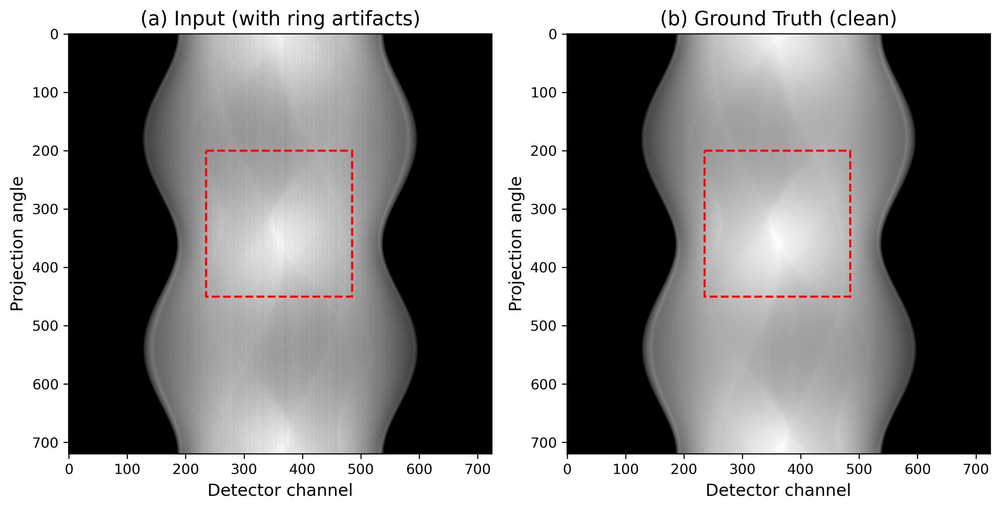

**Notice:** This manuscript has been authored by UT-Battelle, LLC, under contract DE-AC05-00OR22725 with the US Department of Energy (DOE). The US government retains and the publisher, by accepting the article for publication, acknowledges that the US government retains a nonexclusive, paid-up, irrevocable, worldwide license to publish or reproduce the published form of this manuscript, or allow others to do so, for US government purposes. DOE will provide public access to these results of federally sponsored research in accordance with the DOE Public Access Plan (https://www.energy.gov/doe-public-access-plan).

# Summary

BM3DORNL is a high-performance Python library for denoising neutron and X-ray tomography data using a modified Block-Matching and 3D Filtering (BM3D) algorithm.
The library provides two denoising modes: a generic mode for standard noise removal, and a specialized streak mode optimized for removing vertical streak patterns in sinograms that manifest as ring artifacts in reconstructed images.
Built with a Rust backend and Python bindings via PyO3, BM3DORNL processes a sinogram 340$\times$ faster than the reference bm3d-streak-removal implementation while maintaining cross-platform compatibility including native Apple Silicon support.

# Statement of Need

Ring artifacts are a persistent challenge in neutron and X-ray computed tomography, arising from variations in detector pixel response, beam intensity fluctuations, and systematic errors [@münch2009].
These artifacts appear as concentric rings in reconstructed images, obscuring sample structure and degrading quantitative analysis.
Pre-reconstruction streak removal addresses these artifacts directly in sinograms, avoiding the spatial spreading that occurs during reconstruction.
Existing approaches include wavelet-Fourier filtering [@münch2009], polynomial fitting [@vo2018], and sorting-based methods [@miqueles2014], with implementations available in TomoPy [@gürsoy2014].

Mäkinen et al. [@mäkinen2021] demonstrated that applying BM3D [@dabov2007] across multiple scales achieves superior artifact removal by exploiting the self-similarity of streak patterns.
However, their bm3d-streak-removal implementation is closed-source, restricted to non-commercial use, and provides only x86_64 binaries incompatible with Apple Silicon and modern Python versions.
BM3DORNL provides the neutron imaging community with an open-source, MIT-licensed, high-performance implementation that enables both high-throughput batch processing and interactive parameter tuning.

# State of the Field

Several software packages implement pre-processing streak removal for tomography: TomoPy [@gürsoy2014] provides wavelet-Fourier filtering [@münch2009] and Vo's sorting/fitting methods [@vo2018]; ASTRA Toolbox [@van2016] offers GPU-accelerated preprocessing; and bm3d-streak-removal [@mäkinen2021] implements multiscale BM3D but remains closed-source and platform-limited.

\autoref{fig:input} shows the benchmark input data: a synthetic sinogram ($720\times725$ pixels) with simulated ring artifacts and the corresponding clean ground truth.
All benchmark results are from Linux x86_64 to enable comparison with bm3d-streak-removal, which provides only x86_64 binaries.
We compared eight methods: four BM3DORNL variants (streak, generic, multiscale, and Fourier-SVD), three TomoPy algorithms (wavelet-Fourier, sorting-fitting, and sorting-based), and the original bm3d-streak-removal.
The multiscale variant implements the pyramid approach from Mäkinen et al. [@mäkinen2021], while Fourier-SVD is a lightweight FFT-guided method that reaches a similar PSNR at 23$\times$ the speed of the multiscale variant.

{ width=100% }

**Speed comparison:** \autoref{fig:metrics}(a) shows processing times (n=100 runs on Linux x86_64).
Fourier-SVD is the fastest method at 0.017 seconds, achieving 1900$\times$ speedup over bm3d-streak-removal (31.8 seconds).
The BM3D-based methods span a performance range: standard BM3DORNL processes sinograms in 0.094 seconds (340$\times$ faster than bm3d-streak-removal), while multiscale BM3DORNL takes 0.389 seconds (82$\times$ faster) due to pyramid processing.
TomoPy methods achieve processing times of 0.22--0.29 seconds.
Cross-platform behaviour differs substantially: on an Apple M2 Max laptop (12 cores) the TomoPy methods take 3.5--3.6 seconds per sinogram, 12--16$\times$ their times on the 24-core Linux x86_64 host, whereas BM3DORNL's streak mode takes 0.20 seconds and Fourier-SVD 0.022 seconds, about 2$\times$ and 1.3$\times$ their Linux times.
Because the two hosts differ in core count, only same-machine ratios are comparable: BM3DORNL's speed advantage over the fastest TomoPy method grows from 2.4$\times$ on Linux x86_64 to 17$\times$ on Apple Silicon, and the quality metrics agree on both platforms to within 0.001 in SSIM.

**Quality analysis:** We quantify agreement with the ground truth by the peak signal-to-noise ratio (PSNR, in dB) and the structural similarity index measure (SSIM) [@wang2004], both computed after rescaling result and ground truth to $[0, 1]$.
\autoref{fig:results} shows the crop marked in \autoref{fig:input} for the unprocessed input and for all eight methods, each with its difference from the ground truth (image minus ground truth: red above, blue below).
Every column, the input included, carries the same faint blue tint: the benchmark rescales the artifact-laden input to $[0, 1]$, which pins its brightest pixel to the ground truth's maximum and leaves the bulk of the image 3--4% low, and stripe removal preserves that level rather than restoring it.
The tint is therefore not a sign of artifact removal; the artifacts are the vertical stripes, shown in full in the input column, and a method's quality is read from how much of that stripe pattern remains in its own difference image.
Generic BM3DORNL, a standard denoiser rather than a streak remover, leaves the stripes essentially untouched; streak and multiscale BM3DORNL, Fourier-SVD, and bm3d-streak-removal reduce them to a near-uniform residual.
TomoPy SF and BSD leave somewhat stronger stripe residue than those four but also smooth the pixel noise, which the BM3D-based methods largely preserve; SSIM, computed over local $7\times7$ windows in which narrow vertical stripes affect few pixels, rewards that smoothing more than it penalises the remaining stripes, which is why TomoPy SF reaches the highest SSIM (0.987, see \autoref{fig:metrics}(b)).
PSNR, which weighs every pixel equally, ranks bm3d-streak-removal first (43.8 dB).
TomoPy FW alters the low-frequency content of the sinogram, visible as the large red and blue regions in its difference image, and that distortion dominates its error.
All BM3DORNL variants achieve SSIM scores of 0.943--0.976, with multiscale BM3DORNL reaching 0.976 -- above the reference bm3d-streak-removal implementation (0.967).
Fourier-SVD reaches 0.951 in 0.017 seconds while reducing the stripes to a near-uniform residual, showing that most of the artifact can be removed without multi-scale processing.

![Method comparison on the crop marked in \autoref{fig:input}. Top row: the unprocessed input, then the result of each method with its processing time. Bottom row: difference from the ground truth (image minus ground truth) on one zero-centered red--blue scale shared by all columns; red marks pixels above the ground truth, blue marks pixels below it, and white marks agreement, so a perfect result would leave a uniformly white difference image. The faint blue tint common to every column, including the input, comes from the benchmark's rescaling of the input to $[0, 1]$ and is not a sign of removal; the artifacts are the vertical stripes, complete in the input column and remaining in the others to the extent each method left them. Data from Linux x86_64.\label{fig:results}](figure2_results.png){ width=100% }

{ width=100% }

**Platform support:** bm3d-streak-removal is unavailable on Apple Silicon (x86_64 binaries only), incompatible with Python 3.11+, and restricted to non-commercial use.
BM3DORNL provides native performance on all platforms, supports Python 3.12+, and uses the MIT license for unrestricted commercial use.

# Software Design

BM3DORNL employs a hybrid Python-Rust architecture: the core algorithm is implemented in Rust using the `rayon` crate for work-stealing parallelism, with Python bindings via PyO3 for seamless NumPy integration.

**Key optimizations:**

- **Integral image pre-screening:** Before computing expensive patch distances, the block matching stage uses integral images to compute mean and norm bounds in O(1) time. Patches that fail these bounds are skipped, eliminating approximately 80% of distance calculations.

- **FFT with SIMD acceleration:** BM3DORNL defaults to FFT-based transforms with batched row/column passes and specialized $8\times8$ fast paths. FFT plans are computed once and shared across threads via Arc, and a direct-mapped transform cache eliminates redundant computations. An alternative Walsh-Hadamard path is available for multiplication-free processing.

- **SIMD-optimized block matching:** The $8\times8$ patch distance computation uses platform-specific SIMD instructions with a contiguous-memory fast path, reducing the block matching inner loop to near-hardware-limit throughput.

- **Tile-owned aggregation:** Sinograms are processed in tiles that fit in L2/L3 cache, with SIMD-optimized weight accumulation. Per-worker scratch buffers are reused across kernel runs, minimizing memory allocation overhead.

The library provides a minimal Python API:

```python
from bm3dornl import bm3d_ring_artifact_removal

# "streak" mode is the default; sigma_random=0.0 enables
# automatic noise estimation (default is 0.1)
cleaned = bm3d_ring_artifact_removal(sinogram, sigma_random=0.0)
```

**GUI application:** BM3DORNL includes a native GUI built with the egui framework for Rust, installable via `pip install bm3dornl[gui]` or Homebrew on macOS.
The GUI enables interactive parameter tuning, side-by-side comparison with difference visualization, HDF5/TIFF file loading with dataset browsing, and real-time processing feedback with a fast-mode toggle.
At 0.094 seconds per sinogram in the default streak mode (Linux x86_64 benchmark), scientists can explore parameter space interactively at about 10 frames per second---something impractical with bm3d-streak-removal's 32-second processing time.

# Research Impact

BM3DORNL is being integrated into processing pipelines at the VENUS and MARS beamlines at Oak Ridge National Laboratory.
The library provides multiple performance tiers: Fourier-SVD enables real-time parameter exploration at 0.017 seconds per sinogram (1900$\times$ faster than bm3d-streak-removal), standard BM3DORNL offers robust denoising at 0.094 seconds (340$\times$ speedup), and multiscale BM3DORNL provides the highest structural fidelity at 0.389 seconds (82$\times$ speedup).
For batch processing, a 1000-sinogram dataset that would take 9 hours with bm3d-streak-removal completes in 17 seconds (Fourier-SVD), 94 seconds (standard BM3DORNL), or 6.5 minutes (multiscale BM3DORNL).

The hybrid Rust-Python architecture demonstrates a modern approach to scientific software development: Rust provides memory safety and performance portability (single codebase compiles natively to arm64 and x86_64), while Python ensures integration with the NumPy/SciPy ecosystem.
This pattern is increasingly valuable as the scientific computing community diversifies hardware platforms.

BM3DORNL fills a critical gap: the neutron imaging community needed an open-source, actively maintained BM3D implementation that works on modern platforms.
The MIT license enables unrestricted use at national facilities, and native Apple Silicon support ensures scientists can use contemporary hardware for analysis workstations.

# AI Usage Disclosure

Generative AI tools (Claude) were used for code assistance and documentation drafting. All AI-generated content was reviewed, tested, and validated by the authors.

# Acknowledgements

This research used resources at the Spallation Neutron Source, a DOE Office of Science User Facility operated by Oak Ridge National Laboratory.
This work is supported by the U.S. Department of Energy under Contract No. DE-AC05-00OR22725.

# References
